# Mermaid Diagrams — Dark Forest on Aztec

Ordered from high-level context to action-level detail for newcomers.

## High-Level Architecture (Detailed)
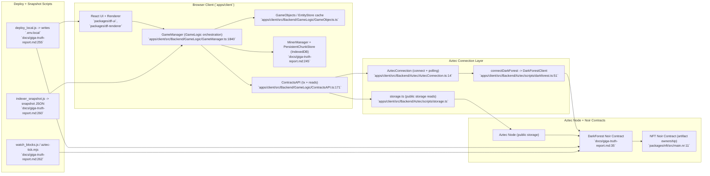

### References
- `apps/client/src/Backend/GameLogic/ContractsAPI.ts:977`
- `apps/client/src/Backend/GameLogic/ContractsAPI.ts:1003`
- `apps/client/src/Backend/GameLogic/ContractsAPI.ts:1103`
- `apps/client/src/Backend/GameLogic/ContractsAPI.ts:1164`
- `apps/client/src/Backend/GameLogic/GameManager.ts:1840`
- `apps/client/src/Backend/Aztec/AztecConnection.ts:14`
- `apps/client/src/Backend/Aztec/scripts/darkforest.ts:51`
- `docs/giga-truth-report.md:245`
- `docs/giga-truth-report.md:255`
- `packages/nft/src/main.nr:11`

## Tx Pipeline (Base + Side Effects)
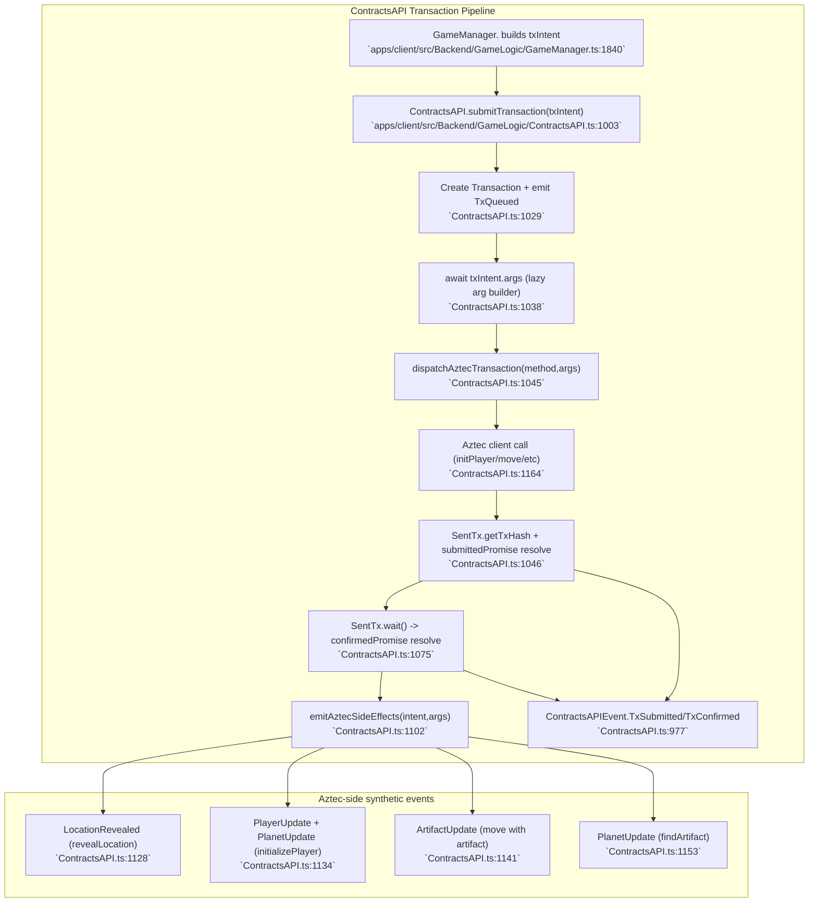

### Key references
- `apps/client/src/Backend/GameLogic/ContractsAPI.ts:1003`
- `apps/client/src/Backend/GameLogic/ContractsAPI.ts:1164`
- `apps/client/src/Backend/GameLogic/ContractsAPI.ts:1126`

## Tx Pipeline (Timings & Metrics)
```mermaid
flowchart TD
  subgraph SubmitTx["submitTransaction() timings"]
    ST1["Create tx + timings.createdAt<br/>`apps/client/src/Backend/GameLogic/ContractsAPI.ts:1026`"]
    ST2["sendStart = Date.now()<br/>`ContractsAPI.ts:1044`"]
    ST3["submittedAt = Date.now(); submitMs/sendMs/proveMs<br/>`ContractsAPI.ts:1048`"]
    ST4["confirmedAt = Date.now(); confirmMs/totalMs<br/>`ContractsAPI.ts:1076`"]
    ST5["detailedLogger: tx.queued/tx.submitted/tx.confirmed<br/>`ContractsAPI.ts:1031`"]
    ST1 --> ST2 --> ST3 --> ST4
    ST1 --> ST5
    ST3 --> ST5
    ST4 --> ST5
  end

  subgraph ResolveArrival["resolveArrival() timings"]
    RA1["sendStart = Date.now()<br/>`apps/client/src/Backend/GameLogic/ContractsAPI.ts:924`"]
    RA2["submittedAt = Date.now(); submitMs<br/>`ContractsAPI.ts:928`"]
    RA3["confirmedAt = Date.now(); confirmMs/totalMs<br/>`ContractsAPI.ts:950`"]
    RA4["detailedLogger: resolve_arrival.* logs<br/>`ContractsAPI.ts:938`"]
    RA1 --> RA2 --> RA3 --> RA4
  end
```

## Tx Pipeline (Timings Embedded)
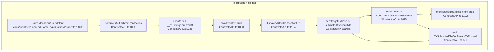

## Tx Pipeline (Unified Timings + Errors)
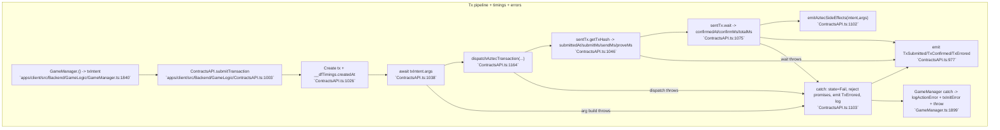

## Error Handling Flow (Tx Pipeline + UI)
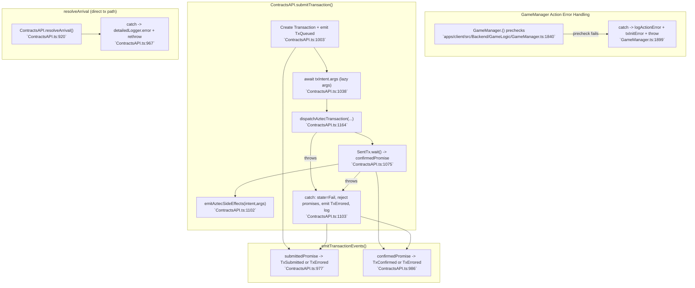

## Resolve Arrival (Direct Tx Path + Timings + Errors)
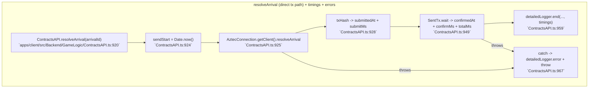

## Client Action Flows (Grouped)

### Player Onboarding & Reveal
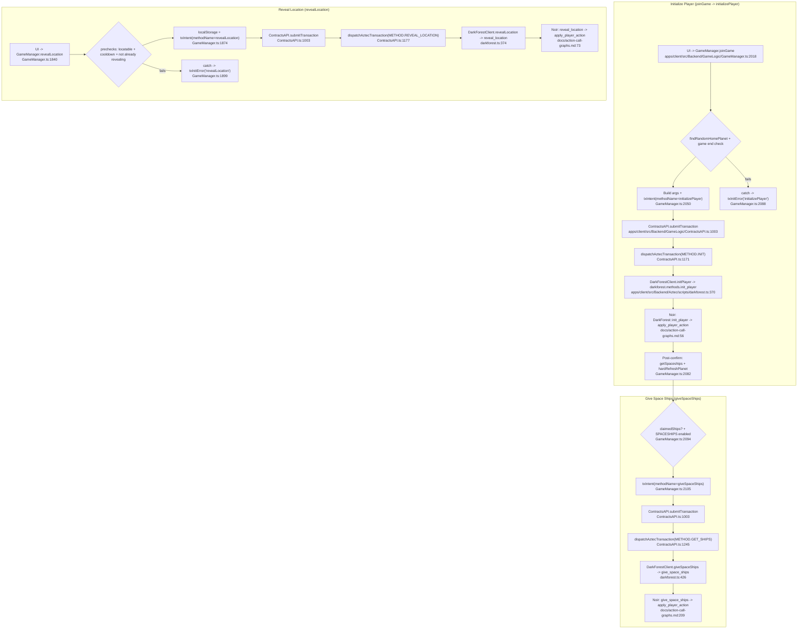

#### Key files
- `apps/client/src/Backend/GameLogic/GameManager.ts:1840`
- `apps/client/src/Backend/GameLogic/GameManager.ts:2018`
- `apps/client/src/Backend/GameLogic/GameManager.ts:2094`

#### Tx pipeline
- `apps/client/src/Backend/GameLogic/ContractsAPI.ts:1003`
- `apps/client/src/Backend/GameLogic/ContractsAPI.ts:1171`
- `apps/client/src/Backend/GameLogic/ContractsAPI.ts:1177`
- `apps/client/src/Backend/GameLogic/ContractsAPI.ts:1245`

#### Aztec bindings
- `apps/client/src/Backend/Aztec/scripts/darkforest.ts:95`
- `apps/client/src/Backend/Aztec/scripts/darkforest.ts:120`
- `apps/client/src/Backend/Aztec/scripts/darkforest.ts:370`

#### Noir entrypoints
- `docs/action-call-graphs.md:56`
- `docs/action-call-graphs.md:73`
- `docs/action-call-graphs.md:209`

### Movement & Upgrades
```mermaid
flowchart TD
  subgraph Move["Move (move)"]
    M1["UI -> GameManager.move<br/>apps/client/src/Backend/GameLogic/GameManager.ts:2746"]
    M2{"prechecks: bounds + ownership + abandonment"}
    M3{"artifact is spaceship?"}
    M4["resolveArrival preflight (if ship stuck)<br/>GameManager.ts:2881"]
    M5["Build args + txIntent(methodName=move)<br/>GameManager.ts:2849"]
    M6["ContractsAPI.submitTransaction<br/>apps/client/src/Backend/GameLogic/ContractsAPI.ts:1003"]
    M7["dispatchAztecTransaction(METHOD.MOVE)<br/>ContractsAPI.ts:1181"]
    M8["DarkForestClient.move -> darkforest.methods.move + perlin/config<br/>apps/client/src/Backend/Aztec/scripts/darkforest.ts:378"]
    M9["Noir: move -> apply_move<br/>docs/action-call-graphs.md:88"]
    Merr["catch -> txInitError('move')<br/>GameManager.ts:2985"]
    M1 --> M2 --> M3
    M3 --yes--> M4 --> M5
    M3 --no--> M5
    M5 --> M6 --> M7 --> M8 --> M9
    M2 --fails--> Merr
  end

  subgraph Resolve["Resolve Arrival (resolveArrival)"]
    RA1["Game loop -> ContractsAPI.resolveArrival<br/>apps/client/src/Backend/GameLogic/ContractsAPI.ts:920"]
    RA2["AztecConnection.getClient().resolveArrival<br/>ContractsAPI.ts:925"]
    RA3["DarkForestClient.resolveArrival -> resolve_arrival<br/>darkforest.ts:428"]
    RA4["Noir: resolve_arrival -> apply_move -> execute_arrival<br/>docs/action-call-graphs.md:106"]
    RA1 --> RA2 --> RA3 --> RA4
  end

  subgraph Upgrade["Upgrade Planet (upgradePlanet)"]
    U1["UI -> GameManager.upgrade<br/>apps/client/src/Backend/GameLogic/GameManager.ts:2996"]
    U2["txIntent(methodName=upgradePlanet)<br/>GameManager.ts:3007"]
    U3["ContractsAPI.submitTransaction<br/>ContractsAPI.ts:1003"]
    U4["dispatchAztecTransaction(METHOD.UPGRADE)<br/>ContractsAPI.ts:1202"]
    U5["DarkForestClient.upgradePlanet -> upgrade_planet<br/>darkforest.ts:412"]
    U6["Noir: upgrade_planet -> apply_player_action<br/>docs/action-call-graphs.md:118"]
    Uerr["catch -> txInitError('upgradePlanet')<br/>GameManager.ts:3021"]
    U1 --> U2 --> U3 --> U4 --> U5 --> U6
    U1 -->|errors| Uerr
  end
```

#### Key files
- `apps/client/src/Backend/GameLogic/GameManager.ts:2746`
- `apps/client/src/Backend/GameLogic/GameManager.ts:2881`
- `apps/client/src/Backend/GameLogic/GameManager.ts:2996`

#### Tx pipeline + dispatch
- `apps/client/src/Backend/GameLogic/ContractsAPI.ts:1003`
- `apps/client/src/Backend/GameLogic/ContractsAPI.ts:1181`
- `apps/client/src/Backend/GameLogic/ContractsAPI.ts:1202`

#### Aztec bindings
- `apps/client/src/Backend/Aztec/scripts/darkforest.ts:378`
- `apps/client/src/Backend/Aztec/scripts/darkforest.ts:412`
- `apps/client/src/Backend/Aztec/scripts/darkforest.ts:428`

#### Noir entrypoints
- `docs/action-call-graphs.md:88`
- `docs/action-call-graphs.md:106`
- `docs/action-call-graphs.md:118`

### Artifacts & Trading
```mermaid
flowchart TD
  subgraph Prospect["Prospect Planet (prospectPlanet)"]
    P1["UI -> GameManager.prospectPlanet<br/>apps/client/src/Backend/GameLogic/GameManager.ts:2279"]
    P2{"prechecks: owner + ruins + not already prospected"}
    P3["localStorage + txIntent(methodName=prospectPlanet)<br/>GameManager.ts:2319"]
    P4["ContractsAPI.submitTransaction<br/>apps/client/src/Backend/GameLogic/ContractsAPI.ts:1003"]
    P5["dispatchAztecTransaction(METHOD.PROSPECT_PLANET)<br/>ContractsAPI.ts:1206"]
    P6["DarkForestClient.prospectPlanet -> prospect_planet<br/>darkforest.ts:414"]
    P7["Noir: prospect_planet -> apply_player_action<br/>docs/action-call-graphs.md:129"]
    P8["Post-confirm: NotificationManager.artifactProspected<br/>GameManager.ts:2330"]
    P1 --> P2 --> P3 --> P4 --> P5 --> P6 --> P7 --> P8
  end

  subgraph Find["Find Artifact (findArtifact)"]
    F1["UI -> GameManager.findArtifact<br/>GameManager.ts:2346"]
    F2{"prechecks: owner + ruins + not already tried"}
    F3["localStorage + txIntent(methodName=findArtifact)<br/>GameManager.ts:2384"]
    F4["ContractsAPI.submitTransaction<br/>ContractsAPI.ts:1003"]
    F5["dispatchAztecTransaction(METHOD.FIND_ARTIFACT)<br/>ContractsAPI.ts:1210"]
    F6["compute biomebase + DarkForestClient.findArtifact<br/>ContractsAPI.ts:1210"]
    F7["darkforest.methods.find_artifact + buildFindArtifactArgs<br/>darkforest.ts:416"]
    F8["Noir: find_artifact -> apply_player_action<br/>docs/action-call-graphs.md:140"]
    F9["Post-confirm: waitForPlanet + NotificationManager.artifactFound<br/>GameManager.ts:2396"]
    F1 --> F2 --> F3 --> F4 --> F5 --> F6 --> F7 --> F8 --> F9
  end

  subgraph Deposit["Deposit Artifact (depositArtifact)"]
    D1["UI -> GameManager.depositArtifact<br/>GameManager.ts:2428"]
    D2["localStorage + txIntent(methodName=depositArtifact)<br/>GameManager.ts:2434"]
    D3["ContractsAPI.submitTransaction<br/>ContractsAPI.ts:1003"]
    D4["dispatchAztecTransaction(METHOD.DEPOSIT_ARTIFACT)<br/>ContractsAPI.ts:1224"]
    D5["DarkForestClient.tradeArtifact(withdrawing=false)<br/>darkforest.ts:420"]
    D6["Noir: trade_artifact -> apply_player_action(action=10)<br/>docs/action-call-graphs.md:157"]
    D7["Post-confirm: updateArtifact.onPlanetId<br/>GameManager.ts:2453"]
    D1 --> D2 --> D3 --> D4 --> D5 --> D6 --> D7
  end

  subgraph Withdraw["Withdraw Artifact (withdrawArtifact)"]
    W1["UI -> GameManager.withdrawArtifact<br/>GameManager.ts:2469"]
    W2["localStorage + txIntent(methodName=withdrawArtifact)<br/>GameManager.ts:2493"]
    W3["ContractsAPI.submitTransaction<br/>ContractsAPI.ts:1003"]
    W4["dispatchAztecTransaction(METHOD.WITHDRAW_ARTIFACT)<br/>ContractsAPI.ts:1228"]
    W5["DarkForestClient.tradeArtifact(withdrawing=true)<br/>darkforest.ts:420"]
    W6["Noir: trade_artifact -> apply_player_action(action=11)<br/>docs/action-call-graphs.md:170"]
    W7["Post-confirm: updateArtifact.onPlanetId=undefined<br/>GameManager.ts:2513"]
    W1 --> W2 --> W3 --> W4 --> W5 --> W6 --> W7
  end

  subgraph Activate["Activate Artifact (activateArtifact)"]
    A1["UI -> GameManager.activateArtifact<br/>GameManager.ts:2526"]
    A2["localStorage + txIntent(methodName=activateArtifact)<br/>GameManager.ts:2556"]
    A3["ContractsAPI.submitTransaction<br/>ContractsAPI.ts:1003"]
    A4["dispatchAztecTransaction(METHOD.ACTIVATE_ARTIFACT)<br/>ContractsAPI.ts:1232"]
    A5["DarkForestClient.setArtifactActivation(activate=true)<br/>darkforest.ts:422"]
    A6["Noir: set_artifact_activation -> apply_player_action(action=12)<br/>docs/action-call-graphs.md:183"]
    A1 --> A2 --> A3 --> A4 --> A5 --> A6
  end

  subgraph Deactivate["Deactivate Artifact (deactivateArtifact)"]
    DA1["UI -> GameManager.deactivateArtifact<br/>GameManager.ts:2584"]
    DA2["localStorage + txIntent(methodName=deactivateArtifact)<br/>GameManager.ts:2602"]
    DA3["ContractsAPI.submitTransaction<br/>ContractsAPI.ts:1003"]
    DA4["dispatchAztecTransaction(METHOD.DEACTIVATE_ARTIFACT)<br/>ContractsAPI.ts:1241"]
    DA5["DarkForestClient.setArtifactActivation(activate=false)<br/>darkforest.ts:422"]
    DA6["Noir: set_artifact_activation -> apply_player_action(action=13)<br/>docs/action-call-graphs.md:197"]
    DA1 --> DA2 --> DA3 --> DA4 --> DA5 --> DA6
  end
```

#### Key files
- `apps/client/src/Backend/GameLogic/GameManager.ts:2279`
- `apps/client/src/Backend/GameLogic/GameManager.ts:2346`
- `apps/client/src/Backend/GameLogic/GameManager.ts:2428`
- `apps/client/src/Backend/GameLogic/GameManager.ts:2526`

#### Dispatch + biomebase calc
- `apps/client/src/Backend/GameLogic/ContractsAPI.ts:1210`
- `apps/client/src/Backend/GameLogic/ContractsAPI.ts:1224`
- `apps/client/src/Backend/GameLogic/ContractsAPI.ts:1228`

#### Aztec bindings
- `apps/client/src/Backend/Aztec/scripts/darkforest.ts:414`
- `apps/client/src/Backend/Aztec/scripts/darkforest.ts:416`
- `apps/client/src/Backend/Aztec/scripts/darkforest.ts:420`

#### Noir entrypoints
- `docs/action-call-graphs.md:129`
- `docs/action-call-graphs.md:140`
- `docs/action-call-graphs.md:157`
- `docs/action-call-graphs.md:183`

### Unsupported/Legacy Tx Intents
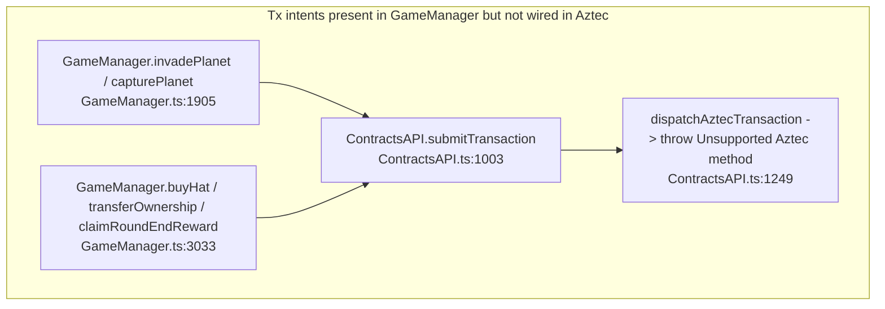

Additional stub: `withdrawSilver` throws before tx dispatch in the Aztec client. `apps/client/src/Backend/GameLogic/GameManager.ts:2629`
